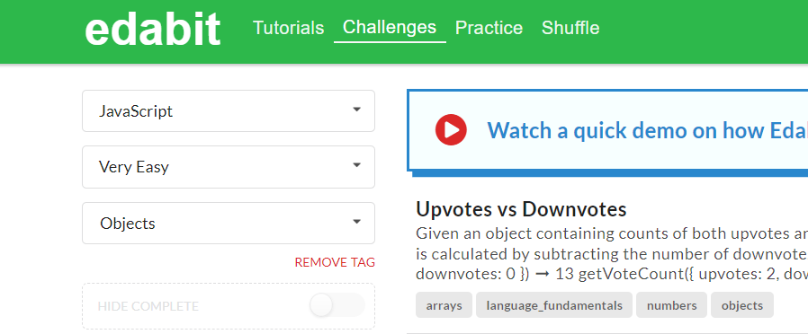

# Objekai

1. Sukurti objekta dog, priskirti jam 4 savybes

2. sukurti kintamaji ir jame isaugoti string tipo sakini sugeneruota panaudojant dog savybiu reikmes. pvz: "Hi this is my dog Barky, it is 3 year old and he is happy"

3. sukurti tuscia objekta 'atostogos'. po sukurimo su '.' notatcija prideti atostogoms savybes: 'salis', 'miestas', 'zemynas' ir 'oras'

4. Pakeisit 'atostogos' sayvbe 'oras' i kita reiksme.

## automobilis

1. Sukurkite tuščią objektą.

2. Sukurkite objektą "automobilis" su savybėmis "marke" ir "metai", kurios atitinka konkretų automobilį.

3. Pridėkite naują savybę "spalva" prie objekto "automobilis" ir priskirkite jai reikšmę "raudona".

4. Pakeiskite objekto "automobilis" savybės "metai" vertę iš pradinės reikšmės į naują reikšmę.

5. Ištrinkite savybę "marke" iš objekto "automobilis".

## Knyga

1. Sukurkite objektą "knyga" su savybėmis "pavadinimas", "autorius" ir "metai".

2. Pridėkite naują savybę "puslapiųSkaičius" prie objekto "knyga" ir priskirkite jai reikšmę.

3. Pakeiskite objekto "knyga" savybės "autorius" vertę į kitą autorių.

4. Ištrinkite savybę "metai" iš objekto "knyga".

5. Pridekite, savybe "parduotuVntSk" su skaitine reiksme.

## Studentas

1. Sukurkite objektą "studentas" pridėkite savybes "vardas", "pavarde", "universitetas" ir "amzius" prie objekto "studentas".

2. sukurtike studentui savybe "pazymiai" kuri lygi objektui.

3. "pazymiai" objektui sukurkite savybes 'Matematika', "Anglu", "Fizika" kurie lygus skaiciams nuo 4 iki 10.

4. parasykite koda kuris suskaiciuotu (be ciklo) visu pazymiai savybiu vidurki

5. yrasykite gauta vidurki i studento objekta kaip 'bendrasVidurkis' savybe.

6. Sukurkite funkciją, kuri priima "studentas" objektą kaip argumentą ir atspausdina jo vardą.

7. Sukurkite funkciją, kuri priima "studentas" objektą kaip argumentą ir padidina jo amžių vienetu.

8. Sukurkite funkciją, kuri priima "studentas" objektą kaip argumentą ir grąžina suformatuotą eilutę su jo pilnu vardu ir amžiumi.

## createElement()

Sukurti tokias strukturas ir patalpinti htmle

1.

```html
<article>
  <h3>JS</h3>
  <p>2023 07 04</p>
  <p>
    Lorem ipsum, dolor sit amet consectetur adipisicing elit. Similique, vel?
  </p>
</article>
```

## Edabit

Javascript -> very easy => Objects


1. https://edabit.com/challenge/654ABGmNS5GqscE8C
2. https://edabit.com/challenge/ms3q5GYSpFpwxeFWX apskaiciuoti turi
3. https://edabit.com/challenge/MQL7KSftPQzrxdJw6
4. https://edabit.com/challenge/Wp8uSyh2tfpdzR4CP
5. savarankiskai pasirinkti edabit
